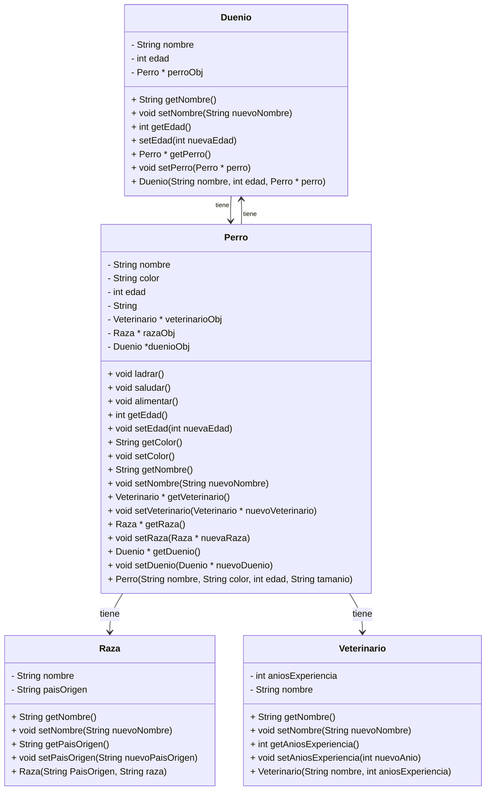

```mermaid

classDiagram
    class Duenio{
        - String nombre
        - int edad
        - Perro * perroObj
        + String getNombre()
        + void setNombre( String nuevoNombre)
        + int getEdad()
        + setEdad(int nuevaEdad)
        + Perro * getPerro()
        + void setPerro(Perro * perro)
        + Duenio( String nombre, int edad, Perro * perro)
    }

    Duenio "tiene"-->Perro
    Perro "tiene"-->Duenio

    class Perro{
      - String nombre
      - String color
      - int edad
      - String
      - Veterinario * veterinarioObj
      - Raza * razaObj
      - Duenio *duenioObj
      + void ladrar()
      + void saludar()
      + void alimentar()
      + int getEdad()
      + void setEdad( int nuevaEdad)
      + String getColor()
      + void setColor()
      + String getNombre()
      + void setNombre( String nuevoNombre)
      + Veterinario * getVeterinario()
      + void setVeterinario( Veterinario * nuevoVeterinario)
      + Raza * getRaza()
      + void setRaza( Raza * nuevaRaza)
      + Duenio * getDuenio()
      + void setDuenio( Duenio * nuevoDuenio)
      + Perro (String nombre, String color, int edad, String tamanio)
    }
    class Veterinario{
      - int aniosExperiencia
      - String nombre
      + String getNombre()
      + void setNombre( String nuevoNombre )
      + int getAniosExperiencia()
      + void setAniosExperiencia(int nuevoAnio)
      + Veterinario (String nombre, int aniosExperiencia)
    }
    class Raza{
      - String nombre
      - String paisOrigen
      + String getNombre()
      + void setNombre(String nuevoNombre)
      + String getPaisOrigen()
      + void setPaisOrigen( String nuevoPaisOrigen)
      + Raza ( String PaisOrigen, String raza)
    }

    Perro --> Raza : tiene
    Perro --> Veterinario : tiene

```

